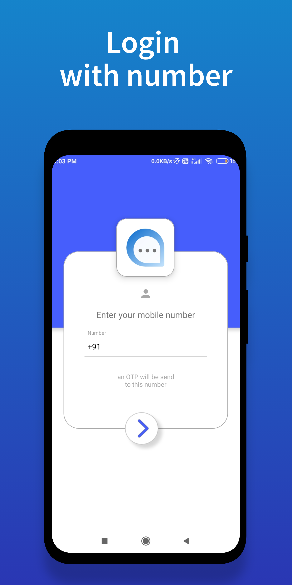
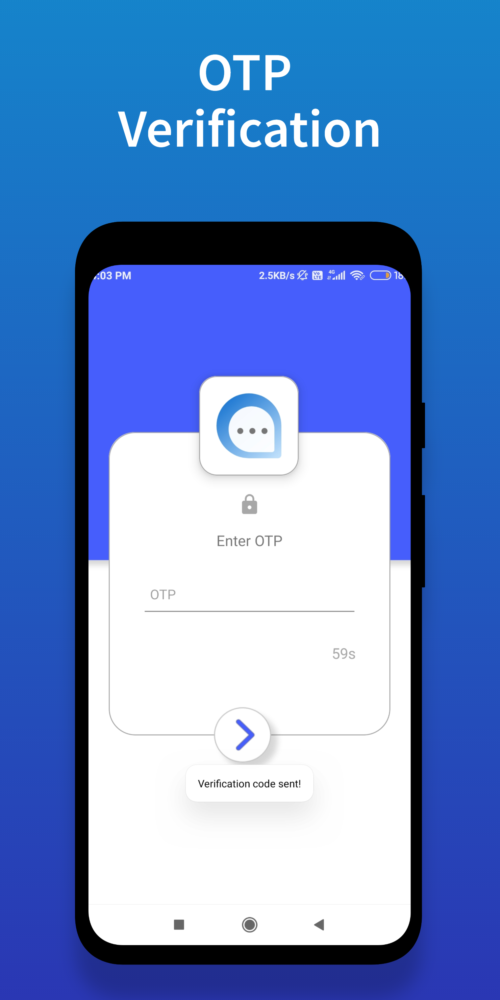
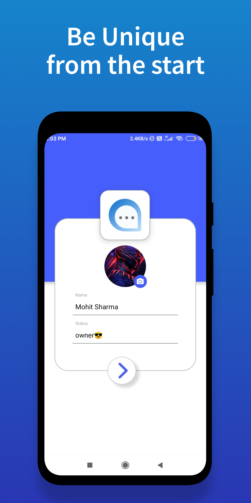
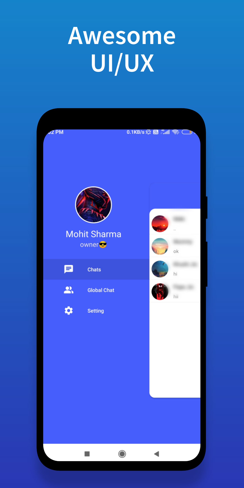
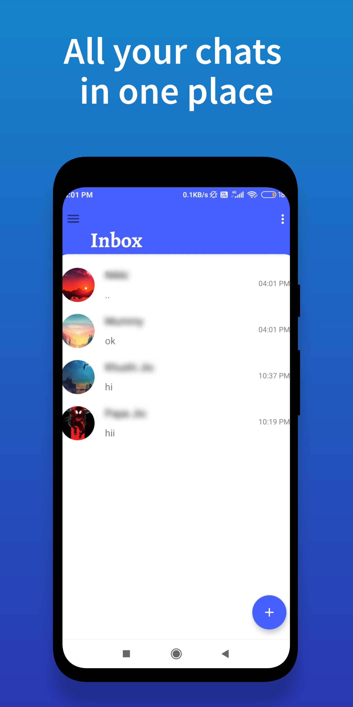
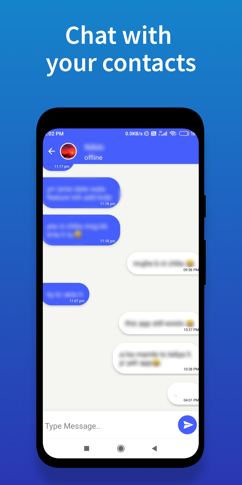
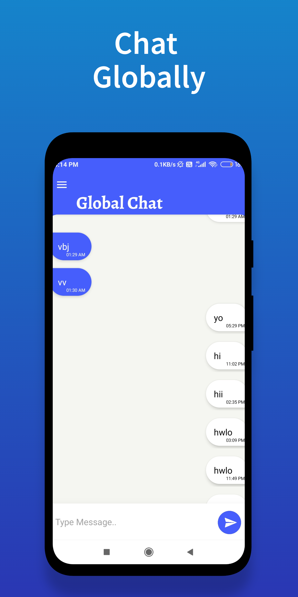
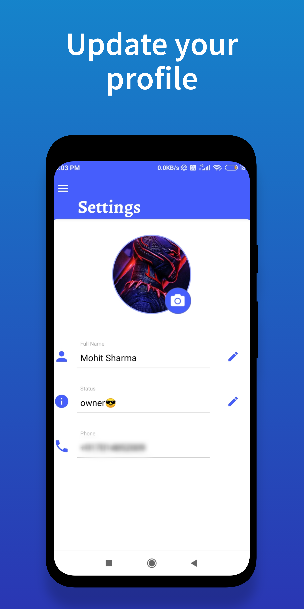

# Lets Chat
Android application for private and public chats. 

### Features

* Secured Registration by OTP verification.
* Enhanced UI/UX.
* Firebase as Backend.
* Chat with your contacts.
* Global chat - All registered users can chat with each other on global chat.
* Update profile picture and status.

### Preview
  
   
  
